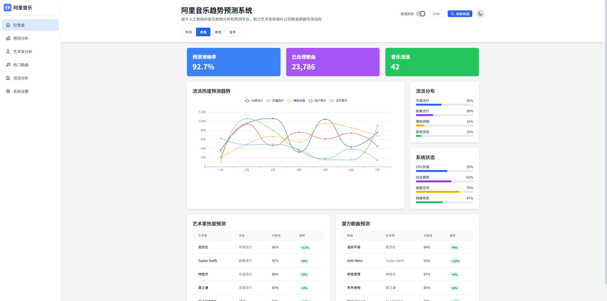

# 🎵 阿里音乐趋势预测系统 (Ali Music Trend Prediction System)

<p align="center">
  
</p>

<p align="center">
  
  
  
  
  
</p>

## 📝 项目介绍

这是一个基于CNN模型的音乐流行趋势预测与可视化系统，旨在通过分析音乐特征来预测歌曲的未来流行度。该项目使用深度学习技术对音频数据进行处理和分析，并通过现代化的前端界面展示分析结果，为音乐创作者和发行方提供数据支持。


## ✨ 项目特点

- 🎯 **趋势预测**：准确预测艺人和音乐作品未来走势
- 📊 **数据可视化**：直观展示音乐市场数据和预测结果
- 🧠 **AI驱动**：基于CNN深度学习模型的智能分析系统
- 🔄 **实时更新**：支持数据实时刷新和定期更新
- 🌙 **深色模式**：支持明暗主题切换，提升用户体验
- 📱 **响应式设计**：完美适配各种设备尺寸

## 🛠️ 技术栈

### 前端
- 🖼️ **前端框架**：Vue 3 + TypeScript
- 🧩 **UI组件**：Element Plus + Tailwind CSS
- 📈 **数据可视化**：ECharts
- 🚀 **构建工具**：Vite
- 🗄️ **状态管理**：Pinia
- 🧭 **路由管理**：Vue Router
- 🔧 **工具库**：VueUse

### 后端/模型
- 🐍 **Python**
- 🧠 **TensorFlow/Keras**
- 🎵 **音频处理库** (Librosa)
- 📊 **数据分析库** (Pandas, NumPy)

## 📋 项目功能

1. 📱 **仪表盘**：总览系统数据和关键指标
2. 📈 **趋势预测**：展示音乐流行度预测结果
3. 👨‍🎤 **艺术家分析**：分析艺术家影响力和发展趋势
4. 🎵 **歌曲数据**：详细展示歌曲特征和表现
5. 🎸 **流派分析**：不同音乐流派的流行趋势分析
6. ⚙️ **系统设置**：个性化配置和数据管理

## 🚀 快速开始

### 前端项目

```bash
# 进入前端项目目录
cd ali-music-trend-predictor

# 安装依赖
npm install

# 开发环境启动
npm run dev

# 生产环境构建
npm run build
```

### 模型部分

```bash
# 安装依赖
pip install -r requirements.txt

# 运行模型训练
python train_model.py

# 启动预测服务
python predict_service.py
```

## 🌐 浏览器支持

- Chrome
- Firefox
- Safari
- Edge

## 📊 数据处理流程

1. 📥 数据收集与清洗
2. 🔍 特征提取和工程
3. 🧠 CNN模型训练
4. 🔮 趋势预测和分析
5. 📊 可视化展示

## 📚 项目结构

```
├── ali-music-trend-predictor/    # 前端项目
│   ├── public/                   # 静态资源
│   └── src/                      # 源代码
│       ├── assets/               # 资源文件
│       ├── components/           # 组件
│       ├── views/                # 页面视图
│       ├── App.vue               # 根组件
│       └── main.ts               # 入口文件
└── model/                        # 模型部分
    ├── data/                     # 数据集
    ├── notebooks/                # 实验笔记本
    └── src/                      # 模型源代码
```

## 👨‍💻 开发团队

由专业的数据科学家、前端开发和UI/UX设计师组成的团队，致力于打造最专业的音乐趋势预测平台。

## 📝 许可证

MIT

---

<p align="center">© 2025 阿里音乐趋势预测系统. All Rights Reserved.</p> 
